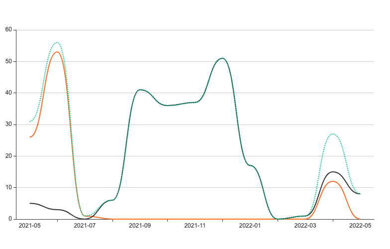

# git stats

</a>

The purpose of this project is to create a graph with Github and Gitlab contributions from a specific time until now.

> *Output example*

## Development

- [x] GitHub API integration
  - [x] Total contributions
  - [x] Repositories contributed
- [x] GitLab API integration
  - [x] Total contributions
  - [ ] Repositories contributed

## Dependencies

This project uses a [cli based on node-html-to-image](https://github.com/frinyvonnick/node-html-to-image-cli) that generates images from HTML.
